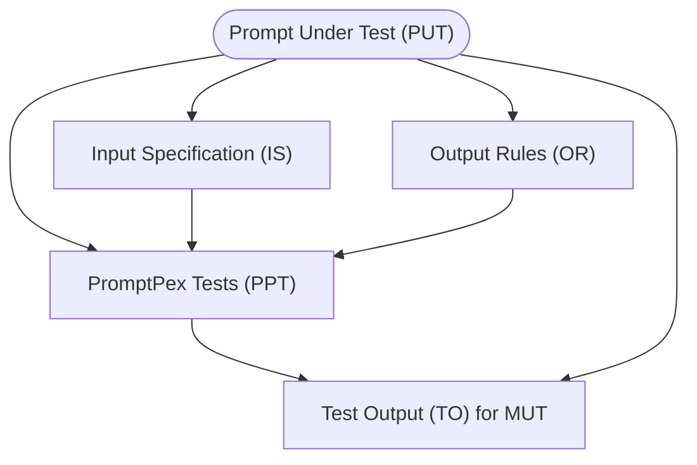
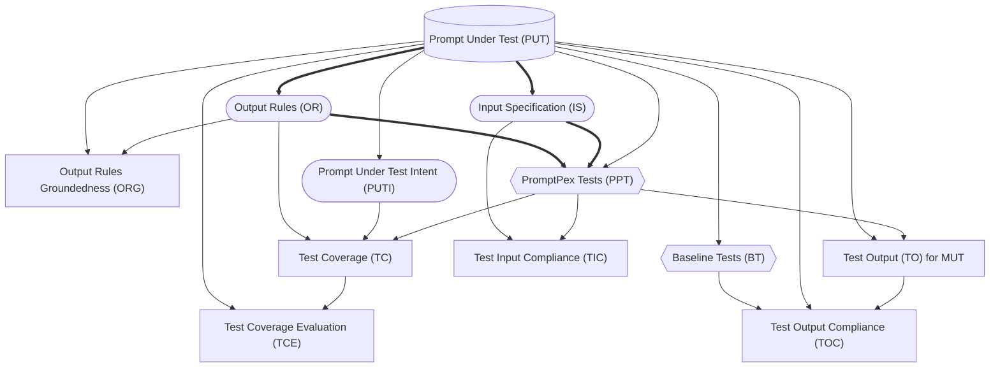

# PromptPex

**Prompts** are an important part of any software project that incorporates
the power of AI models. As a result, tools to help developers create and maintain
effective prompts are increasingly important.

**PromptPex** is a tool for exploring and testing AI model prompts. PromptPex is
intended to be used by developers who have prompts as part of their code base.
PromptPex treats a prompt as a function and automatically generates test inputs
to the function to support unit testing.

PromptPex provides the following capabilities:

- It will **automatically extract output rules** that are expressed in natural language in the
  prompt. An example of a rule might be "The output should be formatted as JSON".
- From the rules, it will **generate unit test cases** specifically
  designed to determine if the prompt, for a given model, correctly
  follows the rule.
- Given a set of rules and tests, PromptPex will **evaluate the
  performance of the prompt on any given model**. For example,
  a user can determine if a set of unit tests succeeds on gpt-4o-mini
  but fails on phi3.

<details>
<summary>Glossary</summary>

- Prompt Under Test (PUT) - like Program Under Test; the prompt
- Model Under Test (MUT) - Model which we are testing against with specific temperature, etc example: gpt-4o-mini
- Model Used by PromptPex (MPP) - gpt-4o

- Input Specification (IS) - Extracting input constraints of PUT using MPP (input_spec)
- Output Rules (OR) - Extracting output constraints of PUT using MPP (rules_global)
- Output Rules Groundedness (ORG) - Checks if OR is grounded in PUT using MPP (check_rule_grounded)

- Prompt Under Test Intent (PUTI) - Extracting the exact task from PUT using MMP (extract_intent)

- PromptPex Tests (PPT) - Test cases generated for PUT with MPP using IS and OR (test)
- Baseline Tests (BT) - Zero shot test cases generated for PUT with MPP (baseline_test)

- Test Input Compliance (TIC) - Checking if PPT and BT meets the constraints in IS using MPP (check_violation_with_input_spec)
- Test Coverage (TC) - Result generated for PPT and BT on PUTI + OR with MPP (evaluate_test_coverage)

- Test Output (TO) - Result generated for PPT and BT on PUT with each MUT (the template is PUT)
- Test Output Compliance (TOC) - Checking if TO meets the constraints in PUT using MPP (check_violation_with_system_prompt)

</details>



## Example

Here is an example of PromptPex in practice.

Prompt:

```text
You are given two items: 1) a sentence and 2) a word contained in that sentence.
You have to determine the part of speech for a given word and return just the tag for the word's part of speech.
Return only the part of speech tag.
If the input isn't a word, return Unknown.
```

Extracted rules:

```text
1. The output must be a valid part of speech tag in abbreviated form (such as ""NN"" for noun, ""VB"" for verb, etc.)
when the input word is identified as a known part of speech.
2. If the input word does not match the standard parts of speech, the output should be the string ""Unknown"".
3. The output must be a single word or abbreviation and should not include any additional text or formatting.
```

Tests generated from the rules:

```text
1. sentence: 'The quick brown fox jumps over the lazy dog.', word: 'fox'
2. sentence: 'Quickly running towards success.', word: 'successful'
(Note this tests the Unknown corner case)
3. sentence: 'She sings beautifully.', word: 'sings'
```

## Test Generation Flow

The diagram below shows the flow of test generation in PromptPex, starting from the PUT (database shape).



<br/>

- Every node is created by a LLM call (aside from the PUT).
- Rounded nodes can be edited by the user.
- Square nodes are evaluations.
- Diamond nodes are outputs.
- Lines represent data dependencies.
- Bolded lines are the minimum path to generate tests.

## Intended Uses

PromptPex is shared for research purposes only. It is not meant to be used in practice. PromptPex was not extensively tested for its capabilities and properties, including its accuracy and reliability in practical use cases, security and privacy.

## Getting Started

**Use CodeSpaces / dev container to get a fully configured environment, including access to LLMs through GitHub Marketplace Models.**

[](https://github.com/codespaces/new?hide_repo_select=true&ref=main&repo=microsoft/promptpex)

### LLM configuration

If you are using a Codespace and have access to [GitHub Marketplace Models](https://github.com/marketplace/models),
PromptPex will automatically use `gpt-4o` and `Phi-3-5-mini-instruct`.

For other LLM providers, follow the [configuration documentation](https://microsoft.github.io/genaiscript/getting-started/configuration/) of GenAIScript
to configure your LLM access.

Then pass the list of models to test as an argument to the `promptpex` command:

```sh
yarn promptpex ... --vars "models=azure:gpt-4o-mini;azure:gpt-3.5-turbo"
```

### Run examples

To run a promptpex generation on a prompt file
using GitHub Marketplace models:

```sh
yarn promptpex:speech-tag
```

You can also run against entire folders and all the .md, .prompty files will be processed

```sh
yarn promptpex samples/**/*.prompty
```

## Development

The following instructions will help you with updating promptpex.

### Typecheck scripts

Use Visual Studio Code to get builtin typechecking from TypeScript or

```sh
yarn build
```

### Create a commit

For convinience,

```sh
yarn gcm
```

### Debug

- Open a `JavaScript Debug Terminal` in Visual Studio Code
- Put a breakpoint in your script
- Launch the script

## Contributing

This project welcomes contributions and suggestions. Most contributions require you to agree to a
Contributor License Agreement (CLA) declaring that you have the right to, and actually do, grant us
the rights to use your contribution. For details, visit https://cla.opensource.microsoft.com.

When you submit a pull request, a CLA bot will automatically determine whether you need to provide
a CLA and decorate the PR appropriately (e.g., status check, comment). Simply follow the instructions
provided by the bot. You will only need to do this once across all repos using our CLA.

This project has adopted the [Microsoft Open Source Code of Conduct](https://opensource.microsoft.com/codeofconduct/).
For more information see the [Code of Conduct FAQ](https://opensource.microsoft.com/codeofconduct/faq/) or
contact [opencode@microsoft.com](mailto:opencode@microsoft.com) with any additional questions or comments.

### Auto-commit message

This script will interactively generate a commit message for the current changes.

```sh
npm run gcm
```

### Pull Request Description and Review

Opening, closing or requesting a review for a pull request will trigger a github action that will automatically add a description and a review.

## Trademarks

This project may contain trademarks or logos for projects, products, or services. Authorized use of Microsoft
trademarks or logos is subject to and must follow
[Microsoft's Trademark & Brand Guidelines](https://www.microsoft.com/en-us/legal/intellectualproperty/trademarks/usage/general).
Use of Microsoft trademarks or logos in modified versions of this project must not cause confusion or imply Microsoft sponsorship.
Any use of third-party trademarks or logos are subject to those third-party's policies.
