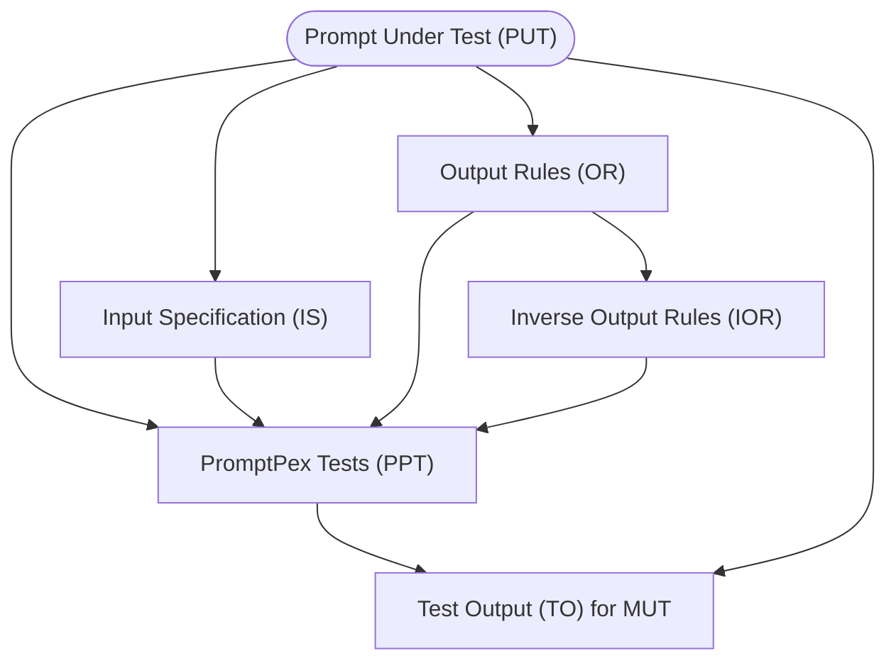
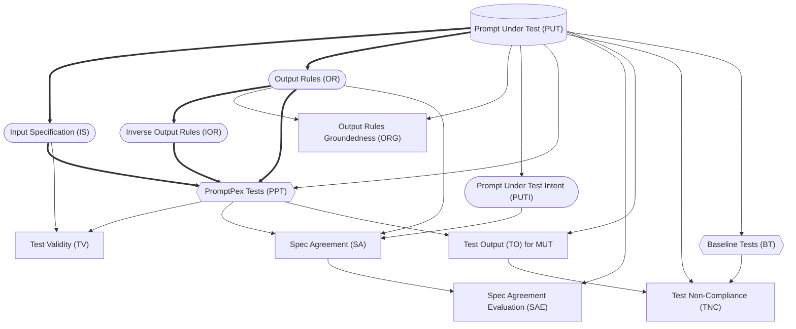

# PromptPex

**Prompts** are an important part of any software project that incorporates
the power of AI models. As a result, tools to help developers create and maintain
effective prompts are increasingly important.

**PromptPex** is a tool for exploring and testing AI model prompts. PromptPex is
intended to be used by developers who have prompts as part of their code base.
PromptPex treats a prompt as a function and automatically generates test inputs
to the function to support unit testing.

PromptPex provides the following capabilities:

-   It will **automatically extract output rules** that are expressed in natural language in the
    prompt. An example of a rule might be "The output should be formatted as JSON".
-   From the rules, it will **generate unit test cases** specifically
    designed to determine if the prompt, for a given model, correctly
    follows the rule.
-   Given a set of rules and tests, PromptPex will **evaluate the
    performance of the prompt on any given model**. For example,
    a user can determine if a set of unit tests succeeds on gpt-4o-mini
    but fails on phi3.
-   PromptPex uses an LLM to automatically determine whether model outputs meet the specified requirements.

<details>
<summary>Glossary</summary>

-   Prompt Under Test (PUT) - like Program Under Test; the prompt
-   Model Under Test (MUT) - Model which we are testing against with specific temperature, etc example: gpt-4o-mini
-   Model Used by PromptPex (MPP) - gpt-4o

-   Input Specification (IS) - Extracting input constraints of PUT using MPP (input_spec)
-   Output Rules (OR) - Extracting output constraints of PUT using MPP (rules_global)
-   Inverse Output Rules (IOR) - Inverse of the generated Output Rules
-   Output Rules Groundedness (ORG) - Checks if OR is grounded in PUT using MPP (check_rule_grounded)

-   Prompt Under Test Intent (PUTI) - Extracting the exact task from PUT using MMP (extract_intent)

-   PromptPex Tests (PPT) - Test cases generated for PUT with MPP using IS and OR (test)
-   Baseline Tests (BT) - Zero shot test cases generated for PUT with MPP (baseline_test)

-   Test Validity (TV) - Checking if PPT and BT meets the constraints in IS using MPP (check_violation_with_input_spec)
-   Spec Agreement (SA) - Result generated for PPT and BT on PUTI + OR with MPP (evaluate_test_coverage)

-   Test Output (TO) - Result generated for PPT and BT on PUT with each MUT (the template is PUT)
-   Test Non-Compliance (TNC) - Checking if TO meets the constraints in PUT using MPP (check_violation_with_system_prompt)

</details>



## Example

Here is an example of PromptPex in practice.

Prompt:

```text
In this task, you will be presented with a sentence and a word contained in that sentence. You have to determine the part of speech
for a given word and return just the tag for the word's part of speech. Return only the part of speech tag.
If the word cannot be tagged with the listed tags, return Unknown. If you are unable to tag the word, return CantAnswer.
```

Input Specification:

```text
1. The input consists of a sentence combined with a specific word from that sentence.
2. The sentence must contain natural language text.
3. The word must be a single word from the provided sentence.
```

Extracted rules:

```text
1. The output must return only the part of speech tag without any additional text or formatting.
2. If the given word can be identified with one of the listed part of speech tags, the output must include only the specific tag for that word from the provided alphabetical list.
3. If the given word cannot be tagged with any of the listed part of speech tags, the output should be the word "Unknown".
4. If tagging the given word is not possible for any reason, the output should be the word "CantAnswer".
```

Tests generated from the rules:

```text
1. sentence: 'An aura of mystery surrounded them.', word: 'aura'
2. sentence: 'The researchers documented carefully.', word: 'carefully'
(Note this tests the Unknown corner case)
3. sentence: 'This is such a unique perspective.', word: 'such'
```

## Getting started

PromptPex uses [GenAIScript](https://microsoft.github.io/genaiscript)
to execute.

-   Install [Node.js v20+](https://nodejs.org/)
-   Configure your LLM credentials in `.env`

```sh
npx --yes genaiscript configure
```

-   Launch promptpex remotely

```sh
npx --yes genaiscript serve --remote microsoft/promptpex
```

### Configure the eval, rules, baseline aliases

If you are using a specific set of models, you can use `.env` to override the eval/rules/baseline aliases.

```text
GENAISCRIPT_MODEL_EVAL="azure:gpt-4o_2024-08-06"
GENAISCRIPT_MODEL_RULES="azure:gpt-4o_2024-08-06"
GENAISCRIPT_MODEL_BASELINE="azure:gpt-4o_2024-08-06"
```

## Test and Eval Workflow

The diagram below shows the flow of test generation in PromptPex, starting from the PUT (database shape).



<br/>

-   Every node is created by a LLM call (aside from the PUT).
-   Rounded nodes can be edited by the user.
-   Square nodes are evaluations.
-   Diamond nodes are outputs.
-   Lines represent data dependencies.
-   Bolded lines are the minimum path to generate tests.

## Intended Uses

PromptPex is shared for research purposes only. It is not meant to be used in practice. PromptPex was not extensively tested for its capabilities and properties, including its accuracy and reliability in practical use cases, security and privacy.

## Developer Guide

**Use CodeSpaces / dev container to get a fully configured environment, including access to LLMs through GitHub Marketplace Models.**

[](https://github.com/codespaces/new?hide_repo_select=true&ref=main&repo=microsoft/promptpex)

### Setup

-   Install [Node.js v20+](https://nodejs.org/)
-   Install dependencies

```sh
npm install
```

### Web interface

-   Launch web interface

```sh
npm run serve
```

-   Open localhost

### Typecheck scripts

Use Visual Studio Code to get builtin typechecking from TypeScript or

```sh
npm run build
```

### Create a commit

For convinience,

```sh
npm run gcm
```

### Debug

-   Open a `JavaScript Debug Terminal` in Visual Studio Code
-   Put a breakpoint in your script
-   Launch the script

### Upgrade dependencies

```sh
npm run upgrade
```

### Diagnostics mode

Set the `DEBUG` or `GENAISCRIPT_DEBUG` environment variable to enable dianostics modes.

```sh
export GENAISCRIPT_DEBUG=1
```

## Responsible AI Transparency Note

Please reference [RESPONSIBLE_AI_TRANSPARENCY_NOTE.md](./RESPONSIBLE_AI_TRANSPARENCY_NOTE.md) for more information.

## Contributing

This project welcomes contributions and suggestions. Most contributions require you to agree to a
Contributor License Agreement (CLA) declaring that you have the right to, and actually do, grant us
the rights to use your contribution. For details, visit https://cla.opensource.microsoft.com.

When you submit a pull request, a CLA bot will automatically determine whether you need to provide
a CLA and decorate the PR appropriately (e.g., status check, comment). Simply follow the instructions
provided by the bot. You will only need to do this once across all repos using our CLA.

This project has adopted the [Microsoft Open Source Code of Conduct](https://opensource.microsoft.com/codeofconduct/).
For more information see the [Code of Conduct FAQ](https://opensource.microsoft.com/codeofconduct/faq/) or
contact [opencode@microsoft.com](mailto:opencode@microsoft.com) with any additional questions or comments.

## Trademarks

This project may contain trademarks or logos for projects, products, or services. Authorized use of Microsoft
trademarks or logos is subject to and must follow
[Microsoft's Trademark & Brand Guidelines](https://www.microsoft.com/en-us/legal/intellectualproperty/trademarks/usage/general).
Use of Microsoft trademarks or logos in modified versions of this project must not cause confusion or imply Microsoft sponsorship.
Any use of third-party trademarks or logos are subject to those third-party's policies.
