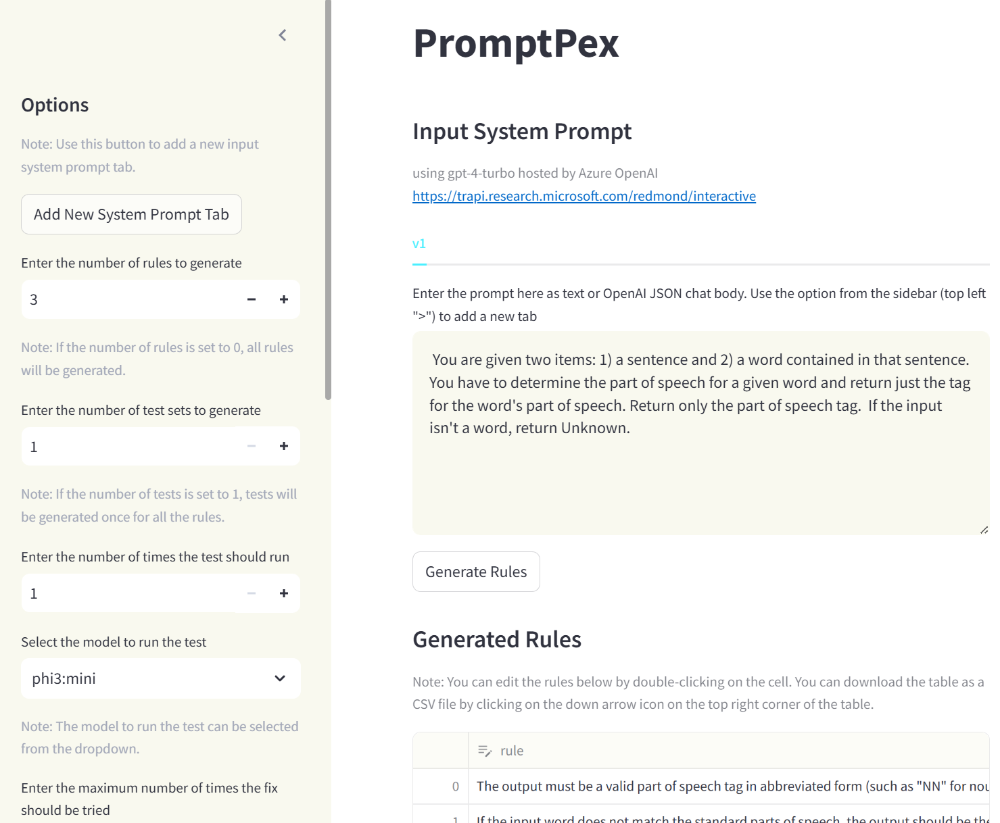

# PromptPex 

**Prompts** are an important part of any software project that incorporates
the power of AI models.  As a result, tools to help developers create and maintain 
effective prompts are increasingly important.

**PromptPex** is a tool for exploring and testing AI model prompts.  PromptPex is 
intended to be used by developers who have prompts as part of their code base.
PromptPex treats a prompt as a function and automatically generates test inputs
to the function to support unit testing.

PromptPex provides the following capabilities:
- It will **automatically extract rules** that are expressed in natural language in the
prompt.  An example of a rule might be "The output should be formatted as JSON".
- From the rules, it will **generate unit test cases** specifically 
designed to determine if the prompt, for a given model, correctly
follows the rule.
- Given a set of rules and tests, PromptPex will **evaluate the 
performance of the prompt on any given model**.  For example, 
a user can determine if a set of unit tests succeeds on gpt-4o-mini
but fails on phi3.

Here is an example of PromptPex in practice.

Prompt:

```text
You are given two items: 1) a sentence and 2) a word contained in that sentence.
You have to determine the part of speech for a given word and return just the tag for the word's part of speech.
Return only the part of speech tag.
If the input isn't a word, return Unknown.
```

Extracted rules:

```text
1. The output must be a valid part of speech tag in abbreviated form (such as ""NN"" for noun, ""VB"" for verb, etc.)
when the input word is identified as a known part of speech.
2. If the input word does not match the standard parts of speech, the output should be the string ""Unknown"".
3. The output must be a single word or abbreviation and should not include any additional text or formatting.
```

Tests generated from the rules:

```text
1. sentence: 'The quick brown fox jumps over the lazy dog.', word: 'fox'
2. sentence: 'Quickly running towards success.', word: 'successful'
(Note this tests the Unknown corner case)
3. sentence: 'She sings beautifully.', word: 'sings'
```

## How to Use PromptPex



PromptPex has a browser-hosted user experience that makes it easy to start using.  PromptPex is implemented with internal prompts that assume you can access gpt-4-turbo (defined in LLMFrontEnd.py).  As a user, you can use any model you have access to, including locally-hosted models, to run tests against.

## Getting Started 

> Use CodeSpaces / dev container to get a fully configured environment, including access to LLMs through GitHub Marketplace Models.

[](https://github.com/codespaces/new?hide_repo_select=true&ref=main&repo=microsoft/promptpex)

### Setup

- Install packages (pre-installed in Codespace)

```sh
pip install -r requirements.txt
```

### LLM configuration

#### GitHub Marketplace Models configuration

If you are using a Codespace and have access to [GitHub Marketplace Models](https://github.com/marketplace/models),
PromptPex will automatically use `gpt-4o` from the github marketplace.

#### Azure OpenAI + Microsoft Entra

- Configure Azure OpenAI end point key `AZURE_OPENAI_ENDPOINT` in the `./.env` file 

```sh
AZURE_OPENAI_ENDPOINT="api endpoint"
```

- Sign in with the [Azure CLI](https://learn.microsoft.com/en-us/cli/azure/). This is the recommended way to access your Azure OpenAI resource is to use Microsoft Entra ID.

```sh
az login
```

#### Azure OpenAI + Access token


Configure the end point `AZURE_OPENAI_ENDPOINT` and access token `AZURE_OPENAI_API_KEY` in the `./.env` file 

```sh
AZURE_OPENAI_ENDPOINT="api endpoint"
AZURE_OPENAI_API_KEY="your_key"
```

> :warning: **Important**: To ensure that sensitive information, such as API keys and endpoints, are not exposed in your repository, it is important to add the `.env` file to the `.gitignore` file. This will prevent the file from being tracked by Git and uploaded to the remote repository.

### Running local server

- Open a terminal and launch this command

```sh
cd app
streamlit run main.py &
```

## Using local models

If you want to leverage local LLMs,
you will need to install and launch Ollama.

```sh
curl -fsSL https://ollama.com/install.sh | sh
export OLLAMA_HOST="127.0.0.1:8502"
```

Launch the Ollama server

```sh
ollama serve & 
```

Only pull the model you want to run, these can fill up storage pretty quickly.

```sh
# ollama pull mistral:latest 
# ollama pull gemma2:9b
ollama pull gemma2:2b 
# ollama pull llama3.1:8b 
# ollama pull phi3:medium 
ollama pull phi3:mini 
# ollama pull gemma2:latest 
# ollama pull llama3.1:latest 
# ollama pull phi3:latest 
# ollama pull phi3:medium-128k
```

### Navigating the CLI

* `automatic_pipeline.py` is the main driver  
* It takes input as a prompt using `-i unix/path`  
* If the input file was `foo.txt` and you want to store the output in result dir, do the following:

```sh
python3 automatic_pipeline.py -i foo.txt -o result
```

It automatically creates the dir result/foo to save the result 
* All paths provided to CLI must be unix path, `use/forward/slash/path` and `\not\backward\slash`
* The most common use case is to run the whole pipeline, gen rules, tests and run tests:

```sh
python3 automatic_pipeline.py -i foo.txt -o result --run-tests
```

* To generate rules and exit, use `--gen-rules` and `--gen-tests` for generating tests and existing
* Gen rules `--gen-rules`, Gen tests `--gen-tests` and Run tests `--run-tests`
* `--use-existing-*` will use the old artifacts (rules and tests)

```sh
python3 automatic_pipeline.py -i foo.txt -o result --run-tests --use-existing-rules --use-existing-tests
```

This will run the existing tests without generating new rules and tests

```sh
python3 automatic_pipeline.py -i foo.txt -o result --gen-tests --use-existing-rules
```

This will generate new tests using the old rules.

`automatic_pipeline.py` implements the end to end automated prompt fixing pipeline. It takes a cli argument as the path to the prompt (in unix style, sample/prompt.txt).  
```py
python3 automatic_pipeline.py sample/LinuxTerminal.txt
```
The results goes into ap-results/ where variant-0.txt is the initial prompt with rules-0.txt as initial rules. 

## Intended Uses
PromptPex is shared for research purposes only. It is not meant to be used in practice. PromptPex was not extensively tested for its capabilities and properties, including its accuracy and reliability in practical use cases, security and privacy.

## Contributing

This project welcomes contributions and suggestions.  Most contributions require you to agree to a
Contributor License Agreement (CLA) declaring that you have the right to, and actually do, grant us
the rights to use your contribution. For details, visit https://cla.opensource.microsoft.com.

When you submit a pull request, a CLA bot will automatically determine whether you need to provide
a CLA and decorate the PR appropriately (e.g., status check, comment). Simply follow the instructions
provided by the bot. You will only need to do this once across all repos using our CLA.

This project has adopted the [Microsoft Open Source Code of Conduct](https://opensource.microsoft.com/codeofconduct/).
For more information see the [Code of Conduct FAQ](https://opensource.microsoft.com/codeofconduct/faq/) or
contact [opencode@microsoft.com](mailto:opencode@microsoft.com) with any additional questions or comments.

### Auto-commit message

This script will interactively generate a commit message for the current changes.

```sh
npm run gcm
```

### Pull Request Description and Review

Opening, closing or requesting a review for a pull request will trigger a github action that will automatically add a description and a review.

## Trademarks

This project may contain trademarks or logos for projects, products, or services. Authorized use of Microsoft 
trademarks or logos is subject to and must follow 
[Microsoft's Trademark & Brand Guidelines](https://www.microsoft.com/en-us/legal/intellectualproperty/trademarks/usage/general).
Use of Microsoft trademarks or logos in modified versions of this project must not cause confusion or imply Microsoft sponsorship.
Any use of third-party trademarks or logos are subject to those third-party's policies.
